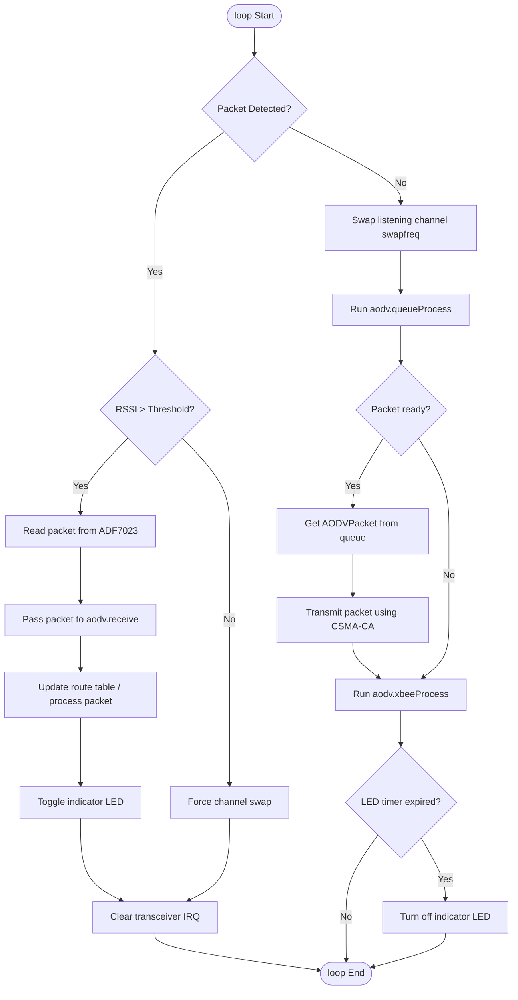

# AODV Routing Library

A high-performance routing library implementing the AODV (Ad-hoc On-Demand Distance Vector) protocol for wireless mesh networking using **ADF7023** transceivers. 

This library is distributed in a **precompiled** format (static `.a` archives for ESP32 and STM32 Cortex-M4 architectures) to protect intellectual property and keep source code proprietary.

---

## Supported Architectures

1. **ESP32** (tested on ESP32 Dev Module) — architecture folder `esp32`.
2. **STM32 GenF4** (tested on `GENERIC_F411CCUX` Cortex-M4 boards) — architecture folder `cortex-m4`.

---

## Library Structure

```text
AODV/
├── library.properties      # Arduino library metadata
├── README.md               # Library documentation
├── src/
│   ├── AODV.h              # Public API header files
│   ├── AODVConfig.h
│   ├── AODVPacket.h
│   ├── AODVPacketQueue.h
│   ├── AODVRouteTable.h
│   ├── AODVXbee.h
│   ├── LinkedList.h
│   ├── StringU8.h
│   ├── systemClockConfig.h
│   ├── esp32/
│   │   └── libAODV.a       # Static library binary for ESP32
│   └── cortex-m4/
│       └── libAODV.a       # Static library binary for STM32 GenF4
└── examples/
    └── AODV_Example/
        └── AODV_Example.ino # Example sketch demonstrating usage
```

---

## Installation

1. Copy the `AODV` directory into your Arduino libraries folder (usually `%USERPROFILE%\Documents\Arduino\libraries\`).
2. Restart your Arduino IDE.
3. Open the example sketch from: **File > Examples > AODV > AODV_Example**.

---

## Compilation & Environment Settings

The precompiled static libraries were compiled under the following environment cores:
*   **ESP32 Core**: `arduino-esp32` version `3.3.10`
*   **STM32 Core**: `stm32duino` (STM32 Cores) version `2.12.0`

### Arduino IDE Configuration Parameters

To compile the provided example sketch successfully in the Arduino IDE, select the target board and configure the following parameters under the **Tools** menu:

#### 1. ESP32 Dev Module
*   **Board**: `"ESP32 Dev Module"`
*   **CPU Frequency**: `240MHz (WiFi/BT)`
*   **Flash Frequency**: `80MHz`
*   **Flash Mode**: `QIO`
*   **Flash Size**: `4MB (32Mb)`
*   **Partition Scheme**: `Default 4MB with spiffs`
*   **PSRAM**: `Disabled`

#### 2. STM32 GenF4 (GENERIC_F411CCUX)
*   **Board**: `"Generic STM32F4 series"`
*   **Board part number**: `"Generic F411CCUx"`
*   **U(S)ART support**: `"Enabled (no generic Serial)"`
*   **USB support**: `"None"`

---

## Integration & API Reference

To integrate the AODV routing library in your Arduino sketch, include the header file and instantiate the main class:

```cpp
#include <AODV.h>
AODV aodv = AODV();
```

---

### Core Classes & Public API

#### 1. `AODV` (Main Controller)
This class manages the routing table, packet queue, persistent EEPROM configurations, and XBee API frame emulation.

*   **Configuration Fields (Settings)**
    *   `uint64_t MAC_ID`: The unique MAC address of the node.
    *   `String nodeName`: Friendly text identifier of the node (up to 31 chars).
    *   `uint8_t routingMode`: Current routing mode (default: `0`).
    *   `uint16_t networkID`: PAN / Network ID (default: `0x7FFF`).
    *   `uint8_t preambleID`: ADF7023 radio preamble configuration (default: `0x00`).
    *   `uint8_t txPowerLevel`: Output transmission power level index (default: `0x04`).
    *   `uint8_t baudrateIndex`: Serial communication baud rate index (default: `0x07`).
    *   `uint8_t broadcastMultiTransmits`: Retransmission count for broadcast packets to ensure reliability (default: `3`).
    *   `uint8_t unicastMacRetries`: Hardware-level MAC retry attempts for unicast packets (default: `10`).
    *   `uint8_t broadcastHops`: Broadcast hop limit (default: `0`, unrestricted).
    *   `uint8_t networkHops`: Unicast maximum network hop count (default: `7`).
    *   `uint8_t networkDelaySlots`: Backoff slot configuration for congestion control (default: `3`).
    *   `uint8_t meshUnicastRetries`: AODV routing-level retries for packets (default: `1`).
    *   `uint16_t nodeDiscoverTimeout`: Discovery scan duration for discovery routines (default: `0x0082`).

*   **Configuration & Initialization Methods**
    *   `void setMAC(uint64_t id)`: Sets the node's unique MAC ID.
    *   `void setNodeName(String name)`: Configures the friendly name of the node.
    *   `void loadSettings()`: Loads config parameters from the device EEPROM.
    *   `void saveSettings()`: Saves current parameters to the device EEPROM.
    *   `void restoreDefaults()`: Resets settings to factory default constants.
    *   `long indexToBaudrate(uint8_t index)`: Translates setting baud index to numeric Baud rate (e.g. `0x07` to `115200`).

*   **Packet Processing Methods**
    *   `AODVPacket receive(uint8_t* raw, int length, float rssi)`: Called inside the main loop when raw bytes are received from the transceiver. Parses AODV frames, updates route paths, and triggers responses if required.
    *   `AODVPacket transmit(int rowID)`: Compiles the queued packet at the specified index into a generic transmittable AODVPacket.
    *   `uint64_t getReceiverMac(uint64_t destID)`: Queries the route table to find the next-hop neighbor's MAC address required to reach target `destID`. Returns `0` if unknown (requiring a Route Request).
    *   `int queueProcess()`: Handles packet timeouts, retry counters, and triggers pending transmissions. Returns the index (`rowID`) of the next packet in the queue ready to be physically sent, or `-1` if no packets require transmission.
    *   `void xbeeProcess()`: Reads and processes incoming XBee API frames from the host serial interface, translating them into AODV packet queries or device settings updates.
    *   `void printTable()`: Outputs the current contents of the active routing table over the hardware serial interface for diagnostic monitoring.

---

#### 2. `AODVPacket`
Represents the structural data frame for AODV wireless messages.
*   **Packet Structure (`aodv_packet`)**:
    *   `uint8_t type`: Packet category (`0` = NULL, `1` = Route Request RREQ, `2` = Route Reply RREP).
    *   `uint64_t transmitterMAC`: Immediate sender (previous hop) MAC.
    *   `uint64_t receiverMAC`: Immediate recipient (next hop) MAC (or `0` for broadcast).
    *   `uint16_t seqID`: Unique serial sequence ID of the packet.
    *   `uint16_t genID`: General message ID counter.
    *   `uint8_t frameID`: XBee transaction correlation frame ID.
    *   `uint8_t retries`: Remaining retransmission attempts.
    *   `uint64_t sourceMAC`: Originating sender of the transmission.
    *   `uint64_t destinationMAC`: Ultimate target recipient of the transmission.
    *   `uint8_t hopCount`: Hops traversed by the packet.
    *   `uint16_t lifetime`: Remaining validity duration of the route (ms).
    *   `StringU8 payload`: Binary payload data.
*   **Key Methods**:
    *   `uint8_t* generateRawData()`: Serializes the packet structure into a raw byte buffer.
    *   `int rawDataLength()`: Returns the size of the serialized raw buffer.
    *   `void parseRawData(uint8_t* raw, int length)`: Deserializes raw radio bytes into the packet object.

---

#### 3. `AODVPacketQueue`
Manages a buffered list of messages scheduled to be sent or waiting for an acknowledgment (Route Reply).
*   **Queue Rows (`AODVPacketQueueRow`)** contain packet metadata, transmission timing details (`timestamp`, `delay`), and retry counts.
*   **Key Methods**:
    *   `void addToQueue(type, command, seqID, genID, frameID, sourceID, destinationID, payload, hops, delay, retries)`: Appends a new message into the scheduling queue.

---

#### 4. `AODVRouteTable`
Maintains the dynamically discovered ad-hoc routing path mappings.
*   **Route Entry (`AODVRouteTableRow`)**:
    *   `uint64_t destinationMAC`: Ultimate destination target.
    *   `uint64_t neighbourMAC`: Next-hop neighbor MAC address.
    *   `uint8_t hopCount`: Metric representing the distance (number of hops).
    *   `float rssi`: The signal strength of the path link.
    *   `unsigned long lifetime`: Millisecond timestamp when this route expires.
*   **Key Methods**:
    *   `uint8_t addToTable(AODVPacket pk, float rssi)`: Updates or adds a path to the routing table based on parsed packet properties.

---

#### 5. `StringU8`
A memory-efficient custom string-like container optimized for handling binary payload arrays in embedded microcontrollers. 
*   Prevents heap fragmentation by managing dynamic `uint8_t` buffers.
*   Includes built-in support for concatenation operators (`+`, `+=`), index access (`[]`), substrings (`substring()`), and standard Arduino `String` conversions.

---

## Network Operation & Protocol Details

### 1. Frequency Hopping & Channel Assignment
To minimize interference and enhance link capacity, AODV uses a dynamic frequency hopping mechanism.
*   **Calculated Channels**: Every node calculates 3 distinct RX frequencies based on its unique hardware MAC address using the `calcFrequenciesByMAC()` function.
*   **Global Channels**: Two static frequencies are shared across all nodes in the network:
    *   `FREQ_BROADCAST_RREQ` (`863,950,000 Hz`): Used for transmitting broadcast Route Requests.
    *   `FREQ_RREP` (`868,950,000 Hz`): Used for responding with Route Replies.
*   **Scanning Loop**: The node constantly swaps between these 5 listening channels using the `swapfreq()` function to actively scan for incoming transmissions.

### 2. Carrier-Sense Multiple Access (CSMA-CA)
To avoid collisions, transmissions use **Carrier-Sense Multiple Access with Collision Avoidance (CSMA-CA)** with a Listen-Before-Talk (LBT) mechanism:
1. Before transmitting, the node turns on the ADF7023 receiver on the chosen target channel.
2. It measures the signal strength (RSSI). If the measured RSSI is higher than `RSSI_LIMIT` (`-90 dBm`), the channel is considered busy.
3. If busy, the node executes a random delay backoff (between `300` and `900` microseconds) and increments the backoff timeout.
4. Once the channel is confirmed clear (or the retry timeout is reached), the packet is physically transmitted.

### 3. Route Discovery Process (RREQ & RREP)
When a node needs to send a packet to an address for which there is no next-hop route in its `AODVRouteTable`:
1. It inserts a `RREQ` (Route Request) packet into the queue with `receiverMAC = 0` (broadcast).
2. The packet is broadcasted on the dedicated `FREQ_BROADCAST_RREQ` channel.
3. Nearby nodes receive the packet. If a node is not the final destination and doesn't have an active route to it, it increments the `hopCount` and retransmits the `RREQ`.
4. When the destination node receives the `RREQ`, it inserts a unicast `RREP` (Route Reply) packet targetting the sender.
5. The `RREP` is sent on `FREQ_RREP`. Each intermediary node uses it to establish a reverse path to the sender before passing it along.
6. Once the originating node receives the `RREP`, the route is marked active, and pending queued data packets are transmitted directly using the next-hop address retrieved from `getReceiverMac()`.

---

## Detailed Execution Flow (Loop Step-by-Step)

The main `loop()` function executes the following state machine continuously:



---

## Documentation & Hardware Modules

For complete technical documentation, pinouts, and detailed descriptions of the ready-made FGRFMesh hardware modules, please visit the official project website:

👉 [fgrfmesh.factorial-group.com.ua](https://fgrfmesh.factorial-group.com.ua/)

---

## ADF7023 Library

👉 [https://github.com/levkovigor/ADF7023](https://github.com/levkovigor/ADF7023)

---

## License

This library is licensed under the MIT License. Feel free to use and modify it for your projects!

---

## 🤝 Acknowledgements

A huge thanks to [Denis Druzhko](https://github.com/denisdruzhko) who has contributed to this project! 

